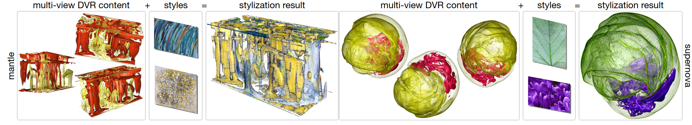
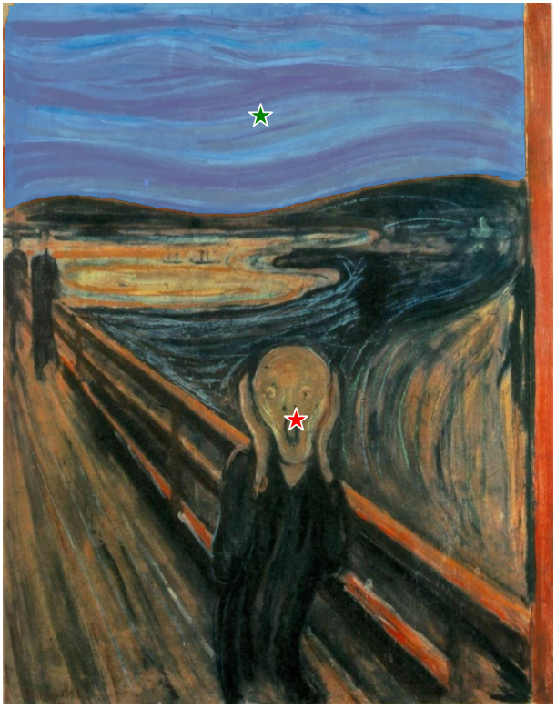
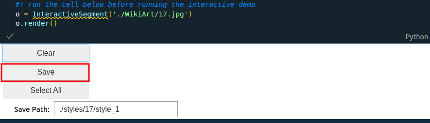

# StyleRF-VolVis: Style Transfer of Neural Radiance Fields for Expressive Volume Visualization

## Description
This is the implementation for TVCG paper StyleRF-VolVis: Style Transfer of Neural Radiance Fields  for Expressive Volume Visualization.

## Setup

```bash
git clone https://github.com/TouKaienn/iVR-GS.git
conda create --name StyleRFVolVis python=3.9
conda activate StyleRFVolVis

#* install pytorch (other versions should be fine)
pip install torch==2.0.1 torchvision==0.15.2 torchaudio==2.0.2 

#* install necessary dependencies
cd StyleRF-VolVis
pip install -r requirements.txt
run ./scripts/install_ext.sh
```

## Multiview image dataset structure
We organize our training image datasets like this:

```
.
└── vortsRGBa
    ├── test
    ├── train
    ├── val
    ├── transforms_test.json
    ├── transforms_train.json
    └── transforms_val.json
```
where ``test`` and ``train`` are folders that contatining the testing and training images, ``.json`` files stores the correponding camera poses. We put an example of image dataset into ``./Data/imgs`` folder, please check its content to know more details.

## Extracting styles from reference style image
We provide an eaily use interactive notebook (located in ``./Data/styles/SegmentAnythingScript/interactive.ipynb``) for users to extract desired styles from reference style image.
Before using, please downlowd SAM model from [here](https://huggingface.co/HCMUE-Research/SAM-vit-h/blob/main/sam_vit_h_4b8939.pth), and put SAM checkpoint ``sam_vit_h_4b8939.pth`` under the folder ``./Data/styles/SegmentAnythingScript/``.

When you run the notebook, a interactive interface with reference style image will appear. Use your mouse to click on style image to add point prompt for selection, left-click will add positive prompt (green) , right-click will add negative prompt (red).
And the transparent blue mask shows the current masking result. An example of selection is shown below:



You can try to add multiple prompts to tweak the masking. After that, you can save the masking result by clicking the button in the notebook.



You can then set the target style in the training setting ( e.g., ``./scripts/configs/vortex.sh`` ).

## Training and Evaluation
We integrate the training, testing, and GUI into a simple script, which located in ``./expscripts/run.sh``.
```bash
cd ..
dataset=${1:-"vortex"}

gui=false
test=false

bash scripts/run_blender.sh scripts/configs/${dataset}.sh -m nerf  
bash scripts/run_blender.sh scripts/configs/${dataset}.sh -m extract  
bash scripts/run_blender.sh scripts/configs/${dataset}.sh -m palette 

if ([ "$gui" = true ] && [ "$test" = false ]); then
    bash scripts/run_blender.sh scripts/configs/${dataset}.sh -m distill -g
elif ([ "$gui" = false ] && [ "$test" = false ]); then
    bash scripts/run_blender.sh scripts/configs/${dataset}.sh -m distill
elif ([ "$gui" = false ] && [ "$test" = true ]); then
    bash scripts/run_blender.sh scripts/configs/${dataset}.sh -m distill -t
elif ([ "$gui" = true ] && [ "$test" = true ]); then
    bash scripts/run_blender.sh scripts/configs/${dataset}.sh -m distill -g -t
fi
```
By default, the script will setup the training of StyleRF-VolVis with training setting configured in ``scripts/configs/vortex.sh``.
By setting the variable ``gui`` or ``test`` to ``True``, you can evaluate or use the GUI to check the rendering results.


## Acknowledgement
A special thanks to the open-source community, especially the following amazing projects:
- [PaletteNeRF](https://github.com/zfkuang/PaletteNeRF)
- [TorchNGP](https://github.com/ashawkey/torch-ngp)
- [NeRF Template](https://github.com/ashawkey/nerf_template)

